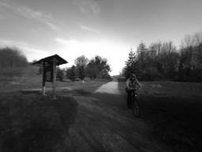

# VAE_CNN

### Dataset Download

The original dataset is from the Freiburg Forest Dataset. In the link below is the modified version which I down scale the image to make it easier for training. The data image size is now 256 X 192. Also, only small portion of dataset is used since it is enough for demonstration purpose. The anomalies in this dataset is the human beings present in front of the camera. I removed all the images that have human beings in the training set.

https://1drv.ms/u/s!Ahbetuf7cZNm0x-2y3xN8IRb2tR8?e=61R9hX

### Prerequisite Installed

1. Pytorch
2. Pillow
3. Matplotlib

### Steps for running this repo

1. Download the data set from the link given above.

2. Unzip the file

3. In main2.py, assign the path of the data folder to the **data_file_path** variable with suffix of *.jpg (e.g. dataset/*.jpg)

4. Create a folder for collecting result, assign the path of the folder to **result_folder** variable

5. Run main2.py to start training

6. Run compare.py to see the result of detecting anomalies (human beings).

### Example

Input:  
 

Output:  

The human with the bike has not presented in the dataset, so it is removed which creates big difference in the input and output. It indicates that the anomaly is detected.

### Reference

Lifelong Navigation. Deepscene Classification. Retrieved from http://lifenav.informatik.uni-freiburg.de/datasets.html
